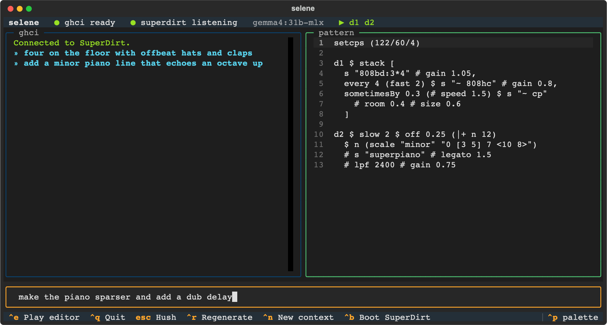

# selene

Describe music in words; a local LLM writes [TidalCycles](https://tidalcycles.org)
patterns and plays them through SuperCollider + SuperDirt.



Type *"slow dubby techno with a deep kick and offbeat hats"*, and selene asks a
local [Ollama](https://ollama.com) model for Tidal code, sends it to a GHCi
running Tidal (the same way Pulsar's TidalCycles plugin does), and it starts
playing. Follow-up prompts revise what's playing: *"add a minor piano line on
d2"*, *"half-time the drums"*, *"make it sparser"*.

- **Code you can edit.** The generated pattern lands in an editor; tweak it and
  press `ctrl+e` to play your version.
- **Self-correcting.** If GHCi rejects the code, the error goes back to the
  model (up to twice) with a hint about the likely mistake. The previous
  pattern keeps playing until something valid arrives.
- **Grounded in your install.** The model is told which Dirt-Samples banks and
  SuperDirt synths you actually have, and code naming sounds you don't have is
  sent back for a fix before it plays.
- **Everything local.** No cloud APIs; default model is `gemma4:31b-mlx`.
- **Lanes.** A row per orbit shows what it plays across the current phrase
  (4 cycles), wiping like a tracker: hits shaded by level, synth notes as
  letters, the previous pass dimmed ahead of the playhead, and the sounds
  each layer played listed after it. Flow's drops, rolls and thinning are
  visible as they happen. `ctrl+l` hides it.
- **Mute by clicking.** Each lane's `d1 d2 d3` chip (in the top bar when the
  lanes are hidden) lights up on every hit: click to mute/unmute, shift-click
  to solo. Mutes survive the model revising the pattern; `esc` clears them.
- **Flow mode.** `ctrl+f` lets the music play itself, from slow drift to
  drops, fills and rhythm mutations on the beat, as active as you set it with
  `/flow 1`–`5`. Off until you turn it on. See [Flow](#flow).
- **Session log.** Every pattern that plays is appended to
  `~/.local/share/selene/<date>.tidal`.

## Requirements

- **Python 3.11+** and [uv](https://docs.astral.sh/uv/)
- **GHC + Tidal**: `ghcup install ghc` then `cabal update && cabal install --lib tidal`
  (tested with GHC 9.14.1, Tidal 1.10.3). `ghci` must be on your `PATH`.
- **SuperCollider + SuperDirt**: install SuperCollider, then in it run
  `Quarks.install("SuperDirt")`. SC3-plugins enable the extra `super*` synths.
- **Ollama** with a model pulled: `ollama pull gemma4:31b-mlx` (any model works;
  see `--model`).

## Run

```sh
git clone https://github.com/jeffehobbs/selene && cd selene
uv run selene                # SuperDirt already running in SuperCollider
uv run selene --superdirt    # or let selene boot sclang + SuperDirt for you
```

Or install it as a command: `uv tool install git+https://github.com/jeffehobbs/selene`.

## Keys

| key | |
|---|---|
| `enter` | generate from the prompt and play |
| `ctrl+e` | play the editor contents |
| `esc` | hush (also cancels a generation) |
| `ctrl+r` | regenerate the last prompt |
| `ctrl+n` | new context: next prompt ignores what's playing |
| `ctrl+f` | Flow on / off (`/flow 1`–`/flow 5` sets how active) |
| `ctrl+s` | save the editor to a `.tidal` file (asks for a name the first time) |
| `ctrl+o` | open a `.tidal` file into the editor (doesn't play it until `ctrl+e`) |
| `ctrl+l` | lanes on / off |
| `ctrl+b` | boot SuperDirt |
| `ctrl+q` | quit (hushes, stops anything selene started) |
| `↑` / `↓` | prompt history |
| drag the divider | resize the ghci log / pattern panels (double-click: back to 50/50) |
| click `dN` | mute / unmute that orbit |
| shift-click `dN` | solo that orbit (again to un-solo) |

In the prompt, `!` sends raw Tidal (`!d3 $ s "cp*4"`), and `/hush`, `/cps 0.6`,
`/bpm 128`, `/mute 2`, `/unmute` (all), `/solo 1`, `/fade 4 [CYCLES]`,
`/fade all`, `/stop 4`, `/take 4`, `/flow`, `/split 30` (the log's share of the width; `/split`
resets), `/save [NAME]`, `/open [NAME]`, `/model NAME`, `/new` are commands.
The split and whether the lanes are showing are remembered between launches
(`~/.local/share/selene/settings.json`).

**Held layers.** Like Tidal itself, playing new code doesn't stop layers it
doesn't mention: open a file with `d1`–`d3` over one with `d1`–`d6` and
`d4`–`d6` keep going, DJ-style. They stay in the lanes below a *held* divider
(amber chips; hover for where they came from), mute and solo like any layer,
and the model knows they're there. `/fade 4` crossfades one out over 8
cycles (`/fade 4 16` over 16; `/fade d4 d5` for several), `/stop 4` cuts it
on the next cycle, `/fade held` / `/stop held` do all the held ones, and
`/take 4` pulls its code back into the editor to work on.

`/fade all` fades *everything* out, current and held, over 8 cycles (or
`/fade all 16`), turning Flow off and ending like `esc`: silent, with your
code still in the editor for `ctrl+e`. Playing anything mid-fade cancels the
silence at the end; `esc` still cuts straight to it.
Anything selene hears playing that it didn't start gets a held lane too.

Files live in `~/Documents/selene` unless you pass `--dir`; a bare name means
`NAME.tidal` there. The editor's title shows the open file, with `•` when it
has unsaved changes. Replacing a different file, or opening over edits that
are neither saved nor playing, asks first.

Edits you make in the editor are the base for your next prompt even if you
haven't played them yet, so you can sketch a change and ask the model to run
with it.

## Flow

A mode, off at launch, in the family of
[Thrum](https://github.com/jeffehobbs/thrum),
[Meter](https://github.com/jeffehobbs/meter) and Counter's Flow: the music
keeps moving on its own while you work. `ctrl+f` toggles it; `/flow N` sets
how active it is (and starts it):

| depth | what moves |
|---|---|
| 1 | slow drift: each layer's level, tone, space and density slide over 20–90 s; nothing announces itself |
| 2 | the same, faster and wider |
| **3** (default) | + **color** (drive, bitcrush, delay send) and **rhythm mutations**: a layer rotates, stutters, goes half- or double-time or reverses for a phrase or two, landing on a 4-cycle boundary |
| 4 | + **arrangement events** on the beat: drops (all but one layer fall out for a phrase, then slam back), fills, rolls, dub delay throws; the model's rewrites get bolder |
| 5 | everything faster, wider, more often |

- **Continuous changes are always ramped** (smootherstep, no edge at either
  end), each layer on its own prime-numbered clock so nothing lines up.
- **Stepped changes land exactly on the beat.** Tidal copies every event to
  selene, so Flow knows where the cycle is and sends each change just before
  Tidal plays that cycle.
- **Density is a zero-sum budget**: it moves between layers (transfers, tilts
  between low and high parts, spotlights, dropouts); the total holds.
- **The model evolves one layer** every 1–11 minutes depending on depth,
  crossfaded in with `xfadeIn`; it may add a layer that swells in from
  silence, or fade one out.
- **Key and tempo never move.** A rewrite that changes the scale is sent back.
- **You lead.** Anything you prompt, play or edit becomes Flow's new starting
  point and holds off rewrites for a while. Muted layers are left alone.
- **Turning Flow off** puts every stepped change back on the next beat and
  glides the rest home over 12 s; what the music evolved into stays playing
  and in the editor. `esc` stops it at once.

Under the hood each `dN` is wrapped in per-orbit controls (`fast`, `rot`,
`ply`, `rev`, `degradeBy`, `gain`, `djf`, `room`, `shape`, `crush`, `delay`)
that selene drives over Tidal's `/ctrl` OSC port, so nothing is re-evaluated
to make the music move. A custom `--boot` file needs the `SELENE_CTRL_PORT`
and `SELENE_TAP_PORT` lines from the bundled `BootTidal.hs` for Flow to work.

## Options

```
--model NAME        Ollama model or family name (default: gemma4:31b-mlx)
--ollama-url URL    default http://localhost:11434
--ghci PATH         GHCi executable (default: ghci)
--boot FILE         BootTidal.hs to load (default: the bundled one)
--superdirt         boot SuperCollider + SuperDirt if it isn't running
--dir FOLDER        where .tidal files are saved/opened (default: ~/Documents/selene)
--flow-depth N      how active Flow is when turned on, 1–5 (default: 3)
--fix-attempts N    times to feed errors back to the model (default: 2)
```

## How it works

GHCi runs as a child process with a BootTidal.hs. Each top-level statement is
wrapped in `:{ … :}` and followed by a sentinel `putStrLn`, so selene knows
exactly which output (and which errors) belong to each evaluation. SuperDirt
is detected with a real OSC `/dirt/handshake`, since `sclang` holds UDP 57120
even when SuperDirt isn't started.

## Tests

```sh
uv run pytest
```

The tests boot Tidal against UDP 57999 with a fake SuperDirt listener, so they
stay silent even while your real SuperDirt is running. The end-to-end test
needs Ollama and a `gemma4` model and is skipped otherwise.

## License

MIT
